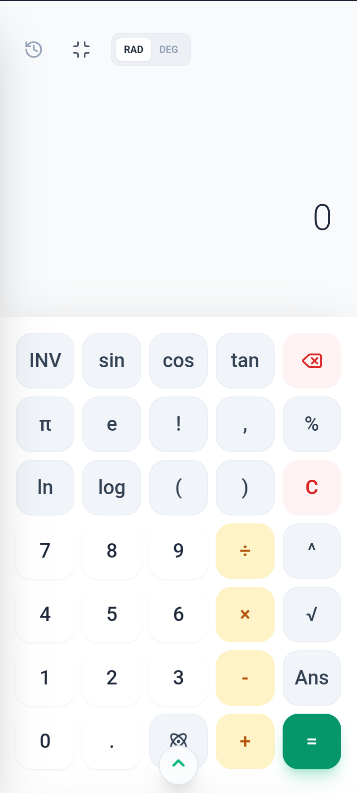

# ZincCalc Pro

**The next generation of mathematical precision for engineers, scientists, and students.**

ZincCalc Pro is a powerful, offline-first calculator application designed for technical professionals. It combines advanced mathematical capabilities with essential scientific tools in a clean, efficient interface.

[](#) 

## ✨ Key Features

ZincCalc Pro is built to handle complex calculations with ease, anywhere, anytime.

### 🧮 Matrix Lab
Perform advanced matrix operations on matrices up to 10x10. Ideal for linear algebra, engineering systems, and complex problem-solving.

### 📚 Extensive Constants Library
Access over 30 built-in scientific and mathematical constants instantly. No more searching for values like π, e, Planck's constant, and more.

### 🌍 Universal Unit Support
Work seamlessly with both **SI and Imperial units**. The calculator adapts to your preferred measurement system, making it perfect for international projects and collaboration.

### 🔒 Offline First
Your calculations never depend on an internet connection. ZincCalc Pro works entirely offline, ensuring you have access whenever and wherever you need it.

## 🚀 Live Demo

Experience ZincCalc Pro for yourself:
[https://zinccalcpro.vercel.app](https://zinccalcpro.vercel.app)

## 🛠️ Built With

*(This section should list the key technologies, frameworks, and libraries you used. Please update them to match your actual stack! Here are common choices for such a project:)*

*   **Framework:** [Vite](https://vitejs.dev/) + React
*   **Language:** [TypeScript](https://www.typescriptlang.org/)
*   **Styling:** [Tailwind CSS](https://tailwindcss.com/)
*   **Core Functionality:** TypeScript for calculation engine
*   **Deployment:** [Vercel](https://vercel.com/)
*   **Numerical Computing**: [math.js](https://mathjs.org/) – fast number crunching in Typescript
  
## 📦 Getting Started for Development

Follow these instructions to get a copy of the project up and running on your local machine for development and testing.

### Prerequisites

*   Node.js (v18 or later recommended)
*   npm, yarn, or pnpm

### Installation

1.  **Clone the repository**
    ```bash
    git clone https://github.com/shahaduddin/zinccalculator.git
    cd zinccalculator
    ```

2.  **Install dependencies**
    ```bash
    npm install
    # or
    yarn install
    # or
    pnpm install
    ```

3.  **Run the development server**
    ```bash
    npm run dev
    # or
    yarn dev
    # or
    pnpm dev
    ```

4.  Open [http://localhost:3000](http://localhost:3000) (or the port specified by your setup) with your browser to see the result.

## 🚀 Deployment

This project is easily deployable on Vercel, the platform it's currently hosted on.

[](https://vercel.com/new/clone?repository-url=https%3A%2F%2Fgithub.com%2Fyour-username%2Fzinccalculator)

For more deployment options, refer to the documentation of the framework you used.

## 🤝 Contributing

Contributions are what make the open-source community such an amazing place to learn, inspire, and create. Any contributions you make are **greatly appreciated**.

If you have a suggestion that would make this better, please fork the repo and create a pull request. You can also simply open an issue with the tag "enhancement".

1.  Fork the Project
2.  Create your Feature Branch (`git checkout -b feature/AmazingFeature`)
3.  Commit your Changes (`git commit -m 'Add some AmazingFeature'`)
4.  Push to the Branch (`git push origin feature/AmazingFeature`)
5.  Open a Pull Request

## 📝 License

Distributed under the MIT License. See [LICENSE](LICENSE) for more information.

## 📧 Contact

Shahad Uddin - [@theshahaduddin](https://x.com/theshahaduddin) - hello@shahaduddin.com

Project Link: [https://github.com/shahaduddin/zinccalculator](https://github.com/shahaduddin/zinccalculator)
